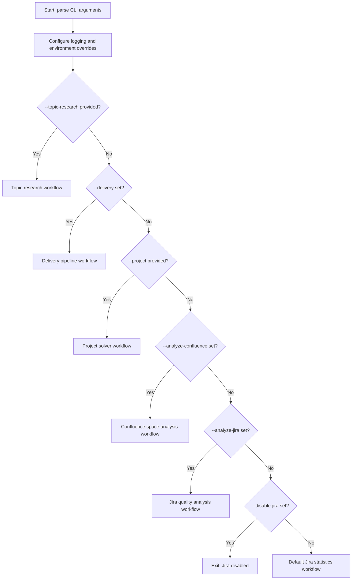
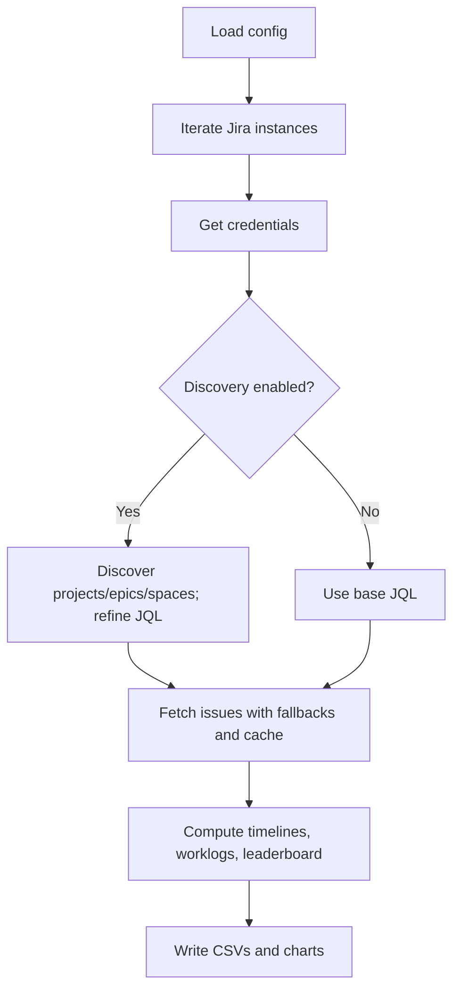
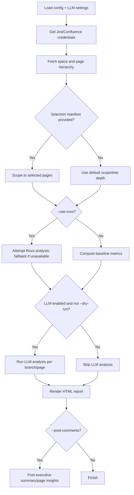
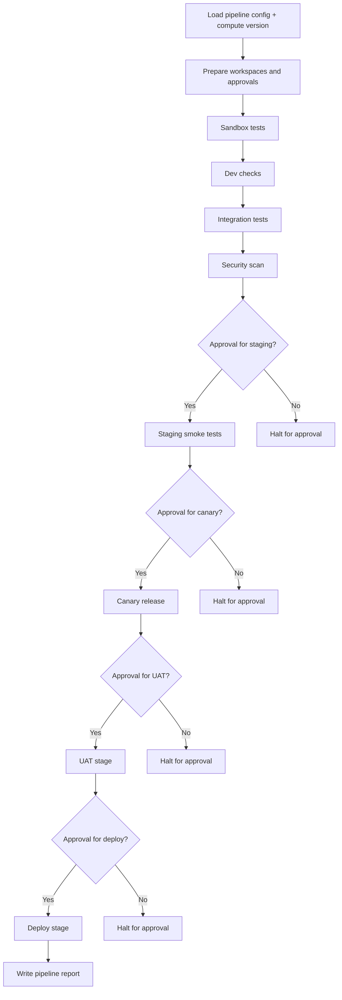
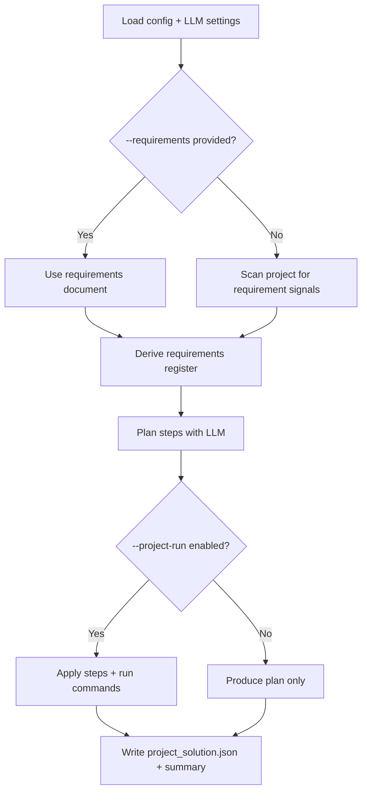

# Refiner

Refiner is a lightweight reporting and analysis toolkit for Jira and Confluence. It discovers relevant scope (projects, epics, and spaces), fetches only the necessary data, and produces CSV/HTML reports on throughput, timelines, and resourcing. It also includes LLM-backed workflows for topic research and project solving.

Key aspects:
- Configuration-driven: company names, Jira URL, custom field IDs, engineer lists, and issue schemas live outside the code in config.json and environment variables.
- Minimal downloads: an optional discovery step narrows JQL so Jira performs most filtering server-side.
- Reusable core: algorithms are data-agnostic so the tool can be reused across organisations and schemas.
- Small-batch fetching with local cache: issue searches are paginated (page_size configurable) to reduce per-request load. A lightweight JSONL cache accumulates fetched pages and can be used as a last-resort data source when servers return little/no data.
- Multi-workflow CLI: a single entry point drives Jira statistics, Jira quality analysis, Confluence space analysis, topic research, and project solving.
- Project solver: scan a local folder for requirement signals, derive a plan with an LLM, and optionally apply file edits/run commands.
- Agentic workflows: explicit plan → act → verify → reflect loops, verification-first execution, and role-based LLM overrides for planning/review.
- Refinement principle: every run should improve the solution in a measurable, qualitative, and quantifiable way, with attention to efficiency and performance where applicable. This principle is core to the Refiner name.
- Reuse & traceability: generated/updated modules are intended to be modular, tracked against requirement IDs, and paired with tests/examples to aid cross-project reuse.
- Privacy for reuse: reusable modules must be scrubbed of user/company-identifying information to prevent cross-project leakage.
- Codebase intent/workflow reference: see [CODEBASE_INTENT_AND_WORKFLOW.md](CODEBASE_INTENT_AND_WORKFLOW.md).


## Quickstart
1) Install dependencies
- pip install -r requirements.txt
- Optional package install for CLI: pip install -e .

2) Configure
- Copy or edit config.json to match your Jira/Confluence instance(s).
- Optionally export environment variables (see below) to supply credentials and overrides.

3) Run (choose a workflow)
- Default Jira statistics: refiner (or python run_refiner.py)
- Jira quality analysis: refiner --analyze-jira --projects CAT --output jira_report.html
- Confluence analysis: refiner --analyze-confluence --space CAT --output confluence_report.html --use-rovo
- Topic research: refiner --topic-research req.txt --output researched_document.md --llm-provider openai
- Project solver: refiner --project /path/to/project --llm-provider openai --output project_solution.json

## Release workflow

GitHub Actions release automation lives in `.github/workflows/build-and-release.yml`.

- `pyproject.toml` is the release version source of truth.
- official GitHub releases require a matching `vX.Y.Z` tag.
- `scripts/package-release.sh --version <pyproject-version> --output-dir ./dist` builds the sdist/wheel set and a checksum manifest.
- manual `workflow_dispatch` runs can package artifacts from any ref.
- publish steps only run from a `v*` tag ref, either automatically on tag push or manually from `workflow_dispatch`.

`versioning.py` still derives a git-aware runtime build identity for the UI and APIs. That build metadata is exposed alongside `release_version`, but it does not override the packaged release version from `pyproject.toml`.

## Web UI + API auth
The web UI is backed by the same Flask server (`refiner_web.py`). It uses session cookies, with dedicated JSON endpoints for headless or cloud-hosted frontends.

## RAG + MCP integrations
Refiner now includes lightweight RAG indexing (for unstructured documents) and MCP connectivity (for structured, action-oriented external systems).

### RAG (Retrieval-Augmented Generation)
- `POST /api/rag/index` — build an index from local files or inline text.
- `POST /api/rag/query` — retrieve the top matches and a combined context block.
- `GET /api/rag/indexes` — list your indexes.
- `DELETE /api/rag/index/<name>` — delete an index.
 - `POST /api/assistant/rag-mcp` — ask a question with optional RAG context and optional MCP tool data.

RAG indexes are stored per user under `job_data/rag/` and only accept file paths within `REFINER_RAG_ALLOWED_ROOTS` (defaults to the repo root + `job_data`). Chunk sizes and limits can be tuned via:
- `REFINER_RAG_CHUNK_SIZE` (default 1200 chars)
- `REFINER_RAG_CHUNK_OVERLAP` (default 200 chars)
- `REFINER_RAG_MAX_CHUNKS` (default 2000)
- `REFINER_RAG_MAX_DOCS` (default 60)
- `REFINER_RAG_MAX_DOC_BYTES` (default 600000)

### MCP (Model Context Protocol)
- `POST /api/mcp/servers` — register an MCP server (admin only).
- `GET /api/mcp/servers` — list MCP servers (admin only).
- `DELETE /api/mcp/servers/<name>` — remove an MCP server (admin only).
- `GET /api/mcp/servers/<name>/tools` — list tools exposed by the MCP server.
- `POST /api/mcp/servers/<name>/call` — call a tool with arguments.
- `GET /api/mcp/servers/<name>/resources` — list available resources.
- `POST /api/mcp/servers/<name>/resource` — read a resource by URI.

MCP endpoints are admin-only because they can execute actions in external systems. Store OAuth/Bearer tokens when registering the server; responses mask secrets.

### Capability inventory
- `GET /api/capabilities` — returns a snapshot of detected workflows, features, and API groups.
- Add `?refresh=1` to rescan the codebase.

### API auth endpoints
- `POST /api/login` with JSON `{ "username": "...", "password": "..." }` sets the session cookie.
- `POST /api/logout` clears the session cookie.
- `GET /api/session` returns `{ authenticated, user, role }`.
- `POST /api/setup` creates the first admin account (only allowed when no users exist).
- `POST /api/sso/issue` issues a short-lived, one-time SSO token (requires an authenticated session).
- `GET /sso?token=...&next=/` exchanges the SSO token for a first-party session and redirects.
- `POST /api/oidc/exchange` exchanges an OIDC authorisation code (PKCE) or `id_token` for a Refiner session and SSO token.

The web login and setup pages now call these endpoints directly.

### Cross-origin setup (cloud frontend + public backend)
Set these environment variables on the backend:
- `REFINER_CORS_ORIGINS`: comma-separated allowlist of frontend origins, e.g. `https://app.example.com`.
- `REFINER_ENFORCE_HTTPS`: set to `1` to require HTTPS (recommended for public endpoints).
- `REFINER_TRUST_PROXY`: set to `1` if TLS is terminated by a proxy/load balancer.
- `REFINER_HOST`: set to `0.0.0.0` for public bind.

Cookies default to `SameSite=None` + `Secure` when CORS is enabled. Use `REFINER_COOKIE_SAMESITE` / `REFINER_SECURE_COOKIES` to override.

For OIDC SPA flows, add the frontend callback URL to `REFINER_OIDC_ALLOWED_REDIRECT_URIS` so `/api/oidc/exchange` can reuse the same redirect URI used during authorisation.

### SSO token storage (optional Redis)
For multi-instance deployments, store one-time SSO tokens in Redis:
- `REFINER_SSO_STORE`: `auto` (default), `redis`, or `memory`.
- `REFINER_SSO_REDIS_URL`: Redis URL (e.g., `redis://:password@host:6379/0`).
- `REFINER_SSO_REDIS_PREFIX`: key prefix (default `refiner:sso:`).
- `REFINER_SSO_TTL`: token lifetime in seconds (default `300`).
The `/api/health` endpoint now returns SSO store status under the `sso` field.

On the frontend, set the API base:
- Add `<meta name="rag-api-base" content="https://api.example.com">` to the page, or
- Set `window.__RAG_API_BASE = "https://api.example.com"` before loading the scripts.

### Deployment (cloud UI + public API)
1) Run the backend behind TLS (reverse proxy or managed load balancer) and expose it on a public domain.
2) Configure the backend:
   - `REFINER_HOST=0.0.0.0`
   - `REFINER_ENFORCE_HTTPS=1`
   - `REFINER_TRUST_PROXY=1` (if TLS terminates upstream)
   - `REFINER_CORS_ORIGINS=https://your-frontend.example,https://your-amplify-branch.amplifyapp.com`
   - `REFINER_COOKIE_SAMESITE=None` and `REFINER_SECURE_COOKIES=1`
   - Serve the API host with a publicly trusted TLS certificate (for example via cert-manager + `letsencrypt-prod`). Browsers reject self-signed certs with `ERR_CERT_AUTHORITY_INVALID`.
3) Point the frontend at the backend origin using `rag-api-base` or `window.__RAG_API_BASE` (for this website: `https://api.neuralmimicry.ai`, not `/auth`).
4) Bootstrap the first user with `POST /api/setup`, then log in with `POST /api/login`.

### Voice STT (native arm64, on-prem)
Refiner supports an on-prem speech-to-text path for `/api/voice/stt` using the Rust service in [`stt_rust/`](stt_rust/README.md), so browser audio can be transcribed locally without cloud STT vendors.

Recommended backend env:
- `REFINER_STT_BACKEND=server`
- `REFINER_STT_SERVER_URL=http://127.0.0.1:7079`
- `REFINER_STT_SERVER_TIMEOUT=25`
- `REFINER_STT_SERVER_PREPROCESS=0` (skip ffmpeg-style preprocess in server mode)
- `REFINER_STT_SERVER_SEND_PROMPT=0` (default `0`, keep prompt hints local unless explicitly required)

Privacy-safe STT learning (optional, enabled by default):
- `REFINER_STT_LEARNING_ENABLED=1`
- `REFINER_STT_KB_LOCAL_PATHS=/home/pbisaacs/Developer/neuralmimicry.ai-website`
- `REFINER_STT_KB_SEED_URLS=https://neuralmimicry.ai`
- `REFINER_STT_LEARNING_ALLOW_NETWORK=1` (only when outbound network is allowed)

When learning is enabled, `/api/voice/stt` builds redacted vocabulary hints from past conversations and
seeded site content. By default these hints are used locally (not retransmitted to Rust server requests).
Set `REFINER_STT_SERVER_SEND_PROMPT=1` only when remote prompt hints are required.
For command backend parity, include `{prompt}` in `REFINER_STT_ARGS` if your STT CLI supports prompt hints.

For a native `arm64` Ubuntu systemd deployment, use:
- `stt_rust/refiner-stt.service`
- `stt_rust/native_arm64_46core.env` (preset tuned for 46 cores)

User-level systemd unit (repo-local paths, no root user required):
- `stt_rust/refiner-stt-user.service`

Robust local launcher (STT + `refiner_web.py` with health checks and restart loop):
- `./scripts/start_refiner_stack.sh`
- If no model is found locally, it auto-downloads `ggml-tiny.en.bin` from the official `ggerganov/whisper.cpp` Hugging Face repo.
- Optional explicit model: `STT_MODEL=/path/to/ggml-*.bin ./scripts/start_refiner_stack.sh`
- Optional profile override: `STT_MODEL_PROFILE=base.en ./scripts/start_refiner_stack.sh`
- Optional URL override: `STT_MODEL_URL=https://.../ggml-model.bin ./scripts/start_refiner_stack.sh`
- One-shot mode (no restart loop): `./scripts/start_refiner_stack.sh --once`

### Prometheus/Grafana metrics
Refiner exposes Prometheus-compatible metrics on `GET /metrics` by default (same port as the web server).
- Disable or change the path with `REFINER_METRICS_ENABLED` or `REFINER_METRICS_PATH`.
- The backend exports request counts/latency, in-flight requests, uptime, job counts by status, queue depth, and worker threads.
- The frontend-only server exports its own request/latency/uptime metrics with a `refiner_frontend_*` prefix.

### Performance tooling
- Latency/load benchmark helper:
  - `./scripts/benchmark_refiner_api.py --url http://127.0.0.1:5001/api/health --method GET --requests 50 --concurrency 10`
- Static bundle budget checks:
  - `./scripts/check_bundle_budgets.py --root .`

### Job completion notifications
Refiner can email users when a job finishes and they are not active in the web UI.

Backend SMTP configuration (set on the API server):
- `REFINER_SMTP_HOST`: SMTP hostname (required to enable email).
- `REFINER_SMTP_PORT`: SMTP port (default `587`).
- `REFINER_SMTP_USER` / `REFINER_SMTP_PASS`: SMTP auth credentials (optional).
- `REFINER_SMTP_FROM`: From address (defaults to `REFINER_SMTP_USER`).
- `REFINER_SMTP_TLS`: set to `1` to enable STARTTLS (default).
- `REFINER_SMTP_SSL`: set to `1` to use SMTP over SSL instead of STARTTLS.
- `REFINER_SMTP_TIMEOUT`: connection timeout seconds (default `20`).
- `REFINER_ACTIVE_WINDOW_SEC`: activity window in seconds for suppressing emails when the UI is active (default `120`).

User email configuration:
- Set the Notification Email under **Global Settings → Notifications** in the web UI, or
- Bootstrap via environment with `REFINER_ADMIN_EMAIL`.
- API jobs can provide `notify_email` in the job payload to override per job.

### Token ledger & billing integration
Refiner exposes a token ledger used by the commercial portal.

Key endpoints:
- `GET /api/tokens` — current balance, reserved, in‑use, capacity, and low threshold.
- `POST /api/tokens` — actions: `review`, `add`, `cashout`, `sync` (balance reconciliation).
- `GET /api/tokens/ledger` — recent ledger entries for audit.
- `POST /api/jobs/estimate` — heuristic token estimate for a job payload.

Notes:
- Job submission is blocked if `estimate > available`.
- Balance never goes negative; any shortfall is recorded on the ledger entry.
- BTC conversion rate defaults to `0.000016` BTC per LLM token (override with `REFINER_TOKEN_BTC_RATE`).
- Admins can grant free (non-cashable) tokens via `POST /api/tokens` with action `grant`.
- Cashout operations only draw down paid token balance; free grants are not cashable.
- To move the ledger of record onto the private blockchain service, set:
  - `REFINER_CHAIN_API_BASE=http://nmchain-host:9080`
  - `REFINER_CHAIN_API_TOKEN=<refiner-app-token>`
  - `REFINER_CHAIN_APP_ID=refiner`
- When `REFINER_CHAIN_API_BASE` is configured, Refiner mirrors successful local/OIDC/SSO logins to `nmchain` and routes token top-up, grant, cashout, refund, reservation, release, debit, and sync writes through the chain-backed ledger.

### Container build and deployment (Podman + Kubernetes)
The `Containerfile` is now aligned for both local container runtime use and Kubernetes:
- non-root runtime user (`uid/gid 10001`)
- writable job-data volume at `/app/job_data`
- built-in healthcheck against `/api/health`
- built-in Rust STT binary for the managed stack launcher
- explicit entrypoint modes: `full` (managed STT + `refiner_web.py`), `backend` (backend only, for external STT), `frontend`, `tests`, `smoke`, `cli`

#### 1) Build image locally
Refiner stamps runtime build metadata from git commit count during image build, so the Control Room build version can show as `x.y.zzzz` and change on every commit. Official release tags and Python package artifacts still follow `pyproject.toml`.

Podman:
- `podman build --format docker -t refiner:latest -f Containerfile .`

Docker:
- `docker build -t refiner:latest -f Containerfile .`

Multi-arch:
- `podman build --format docker --platform linux/amd64,linux/arm64 -t refiner:latest -f Containerfile .`
- `docker buildx build --platform linux/amd64,linux/arm64 -t refiner:latest -f Containerfile .`

Note: Podman default OCI output does not retain Dockerfile `HEALTHCHECK` metadata. Keep `--format docker` if you need health checks visible via `podman ps`/`podman healthcheck`.

#### 2) Run Refiner suite in Podman
Backend/API-only mode (use when STT is provided externally via `REFINER_STT_*` env vars):
- `podman run --rm -p 5001:5001 -v "$(pwd)/job_data:/app/job_data:Z" refiner:latest backend`

Frontend helper mode:
- `podman run --rm -p 8080:8080 -e REFINER_API_BASE=http://127.0.0.1:5001 refiner:latest frontend`

Default/full mode:
- `podman run --rm -p 5001:5001 -v "$(pwd)/job_data:/app/job_data:Z" refiner:latest`
- This starts the same managed STT + `refiner_web.py` stack as `./scripts/start_refiner_stack.sh`.
- If no STT model is present, the container auto-downloads it into `/app/job_data/models`.

Run full automated test suite inside the image:
- `podman run --rm refiner:latest tests`

Run fast smoke checks:
- `podman run --rm refiner:latest smoke`

Run CLI workflow directly:
- `podman run --rm -v "$(pwd):/workspace:Z" -w /workspace refiner:latest cli --help`

#### 3) Push image to registry
GHCR login:
- `echo "$GHCR_TOKEN" | podman login ghcr.io -u "$GHCR_USER" --password-stdin`
- `echo "$GHCR_TOKEN" | docker login ghcr.io -u "$GHCR_USER" --password-stdin`

Tag + push:
- `podman tag refiner:latest ghcr.io/<org>/refiner:latest`
- `podman push ghcr.io/<org>/refiner:latest`

Docker buildx push (multi-arch):
- `docker buildx build --platform linux/amd64,linux/arm64 -t ghcr.io/<org>/refiner:latest -f Containerfile . --push`

#### 4) Kubernetes deployment
Create namespace + secret:
- `kubectl create namespace refiner`
- `kubectl -n refiner create secret generic refiner-secrets --from-literal=REFINER_SECRET_KEY='<strong-random-secret>' --from-literal=REFINER_ADMIN_PASSWORD='<admin-password>'`

Apply deployment/service (`refiner-k8s.yaml`):

```yaml
apiVersion: apps/v1
kind: Deployment
metadata:
  name: refiner
  namespace: refiner
spec:
  replicas: 2
  selector:
    matchLabels:
      app: refiner
  template:
    metadata:
      labels:
        app: refiner
    spec:
      securityContext:
        runAsNonRoot: true
        runAsUser: 10001
        runAsGroup: 10001
        fsGroup: 10001
      containers:
      - name: refiner
        image: ghcr.io/<org>/refiner:latest
        imagePullPolicy: IfNotPresent
        args: ["full"]
        ports:
        - containerPort: 5001
          name: http
        env:
        - name: REFINER_HOST
          value: "0.0.0.0"
        - name: REFINER_PORT
          value: "5001"
        - name: REFINER_JOB_DIR
          value: "/app/job_data"
        - name: REFINER_SECRET_KEY
          valueFrom:
            secretKeyRef:
              name: refiner-secrets
              key: REFINER_SECRET_KEY
        - name: REFINER_ADMIN_PASSWORD
          valueFrom:
            secretKeyRef:
              name: refiner-secrets
              key: REFINER_ADMIN_PASSWORD
        readinessProbe:
          httpGet:
            path: /api/health
            port: http
          initialDelaySeconds: 10
          periodSeconds: 10
        livenessProbe:
          httpGet:
            path: /api/health
            port: http
          initialDelaySeconds: 30
          periodSeconds: 20
        volumeMounts:
        - name: job-data
          mountPath: /app/job_data
      volumes:
      - name: job-data
        persistentVolumeClaim:
          claimName: refiner-job-data
---
apiVersion: v1
kind: Service
metadata:
  name: refiner
  namespace: refiner
spec:
  selector:
    app: refiner
  ports:
  - name: http
    port: 5001
    targetPort: http
---
apiVersion: v1
kind: PersistentVolumeClaim
metadata:
  name: refiner-job-data
  namespace: refiner
spec:
  accessModes:
  - ReadWriteOnce
  resources:
    requests:
      storage: 10Gi
```

If your cluster requires an explicit storage class, add `storageClassName` under the PVC `spec`.

Deploy:
- `kubectl apply -f refiner-k8s.yaml`

Check rollout + health:
- `kubectl -n refiner rollout status deployment/refiner`
- `kubectl -n refiner get pods,svc`
- `kubectl -n refiner logs deploy/refiner --tail=200`

#### 5) Continuum control-plane integration (NMC)
NeuralMimicry Continuum (`nmc`) now includes a `refiner` command group to manage this deployment lifecycle directly with `kubectl`.

Build `nmc` client:
- `cmake -S /home/pbisaacs/Developer/neuralmimicry/nmc/nmc_client -B /tmp/nmc_client_build`
- `cmake --build /tmp/nmc_client_build`

Control Refiner via Continuum:
- `/tmp/nmc_client_build/nmc refiner deploy --manifest ./refiner-k8s.yaml --namespace refiner --timeout 300`
- `/tmp/nmc_client_build/nmc refiner status --namespace refiner`
- `/tmp/nmc_client_build/nmc refiner scale --namespace refiner --replicas 3`
- `/tmp/nmc_client_build/nmc refiner logs --namespace refiner --tail 300`
- `/tmp/nmc_client_build/nmc refiner remove --namespace refiner --delete-storage`

#### 6) Security tracking integration (Tracey)
Tracey now supports Refiner-specific tracking with:
- periodic health probe checks (`/api/health`)
- JSONL security finding feed ingestion (for container vulnerability findings)

Example Tracey config block:
```json
"refiner": {
  "enabled": true,
  "source": "refiner",
  "service_name": "refiner",
  "health_url": "http://127.0.0.1:5001/api/health",
  "security_feed_path": "refiner_security_feed.jsonl",
  "poll_interval_ms": 5000,
  "timeout_ms": 2500
}
```

Example security feed line (append JSONL):
```json
{"service":"refiner","image":"ghcr.io/<org>/refiner:latest","severity":"high","cvss":8.6,"cve":"CVE-2026-12345","title":"openssl vulnerable dependency","scanner":"trivy","status":"open","finding_id":"trivy-001"}
```

Generate feed entries from a real image scan:
- `./scripts/export_refiner_security_feed.sh ghcr.io/neuralmimicry/refiner:latest refiner_security_feed.jsonl`

The default Jira statistics workflow can (optionally) run discovery, refine your JQL, fetch issues, generate monthly CSVs and a leaderboard, and write a consolidated timelines.csv. If the refined JQL returns no results, the tool automatically retries with your base JQL to avoid empty runs due to over-filtering.


## Workflow overview
Workflow selection order (run_refiner.py):
1) --topic-research
2) --delivery
3) --project
4) --analyze-confluence
5) --analyze-jira
6) Default Jira statistics workflow (unless --disable-jira is set)

Summary of workflows:

| Workflow | Trigger | Primary outputs | Summary |
| --- | --- | --- | --- |
| Jira statistics | No workflow flags | CSVs + charts | Discovery-driven reporting across Jira instances (timelines, worklogs, leaderboard). |
| Jira quality analysis | --analyze-jira | jira_report.html | Interactive HTML report with optional LLM insights, action plan, and comment posting. |
| Confluence space analysis | --analyze-confluence --space | confluence_report.html | Interactive HTML report with optional LLM/Rovo insights, action plan, and comment posting. |
| Topic research | --topic-research | researched_document.md (+ references) | Iterative research with Jira/Confluence context and optional web search. |
| Delivery pipeline | --delivery --project | delivery_pipeline_output/pipeline_report_*.json | Staged sandbox/dev/integration/staging/uat/deploy pipeline with approvals and artifact capture. |
| Project solver | --project | project_solution.json | Requirements extraction, planning, and optional code changes/commands. |


## Workflow diagrams
### Workflow selection (run_refiner.py)


### Jira statistics workflow (default)


### Jira quality analysis workflow
```mermaid
flowchart TD
    A[Load config + LLM settings] --> B[Get Jira credentials]
    B --> C[Resolve scope: --jql or --projects]
    C --> D[Fetch issues + linked Confluence content (optional)]
    D --> E{LLM enabled and not --dry-run?}
    E -- Yes --> F[Generate LLM insights per issue]
    E -- No --> G[Baseline metrics only]
    F --> H[Render HTML report]
    G --> H
    H --> I{--post-comments?}
    I -- Yes --> J[Post comments to Jira/Confluence]
    I -- No --> K[Finish]
```

### Confluence space analysis workflow


### Topic research workflow
```mermaid
flowchart TD
    A[Load config + LLM/search settings] --> B[Read topic + requirements]
    B --> C[Gather Jira/Confluence context (unless disabled)]
    C --> D{Search engine configured?}
    D -- Yes --> E[Search the web and fetch sources]
    D -- No --> F[Skip web search]
    E --> G[Iterative draft/critique/refine loop]
    F --> G
    G --> H[Write researched document + references]
```

### Delivery pipeline workflow


### Project solver workflow


## Workflow details and key flags
### Jira statistics workflow (default)
- Trigger: no workflow flags and Jira is not disabled.
- Scope: uses discovery (if enabled) to refine the base JQL; falls back to broader queries if results are sparse.
- Outputs: CSVs and charts listed in the Outputs section.
- Key controls: discovery/search settings in config.json plus environment overrides (e.g., PREFER_CLIENT_SEARCH, RECENT_DAYS).

### Jira quality analysis workflow
- Trigger: `--analyze-jira`.
- Scope: `--jql` overrides `--projects`. If neither is provided, the analyser falls back to discovery or a safe default query.
- Optional selection: `--selection` can limit analysis using the HTML report selection manifest.
- LLM: configure with `--llm-provider`/`--llm-model` and optional fallbacks; use `--dry-run` to skip LLM calls while still producing the HTML report.
- Action plans: `--action-plan` adds an action plan section to the report (LLM-backed when available).
- Comment posting: `--post-comments`, `--post-target`, and `--dry-run-post`.

### Confluence space analysis workflow
- Trigger: `--analyze-confluence --space <KEY>`.
- Scope controls: `--tree-depth`, `--starting-depth`, and `--selection` (selection manifest).
- Rovo/LLM: `--use-rovo` attempts Rovo analysis; use `--llm-provider`/`--llm-model` for LLM analysis and `--dry-run` to skip LLM calls.
- Action plans: `--action-plan` adds an action plan section to the report (LLM-backed when available).
- Templates: `--emit-templates` and `--templates-dir` for local template output.
- Comment posting: `--post-comments`, `--post-exec-summary`, `--post-page-insights`, and `--dry-run-post`.

### Delivery pipeline workflow
- Trigger: `--delivery --project <PATH>`.
- Config: `delivery_pipeline.json` by default (override with `--delivery-config`, or use `--delivery-config default` to force the bundled config).
- Safety: commands only execute when `--delivery-run` is supplied; otherwise the pipeline is a dry-run plan.
- Approvals: create `delivery_pipeline_output/approvals/<stage>.ok` (or set `approval_file` per stage) to unblock gated stages.
- Optional solver integration: `--delivery-project-solution` overlays the solver workspace and records completion status in the report.
- Override: use `--delivery-allow-unfinished` to permit deploy stages on incomplete code for interim validation.
- Interim stages: use `--delivery-enable-interim` to enable the optional `interim_deploy` + `interim_teardown` stages without editing the config.
- Versioning: computed from git (or timestamp fallback) and optionally written to `delivery_pipeline_output/VERSION` when `versioning.write_file` is enabled.
- VCS integration: configure `vcs` in `delivery_pipeline.json` (defaults to `github.com/neuralmimicry`); supports pull/branch/commit/merge/push/tag/release actions.
- You can gate VCS actions with `vcs.requires_approval` and `vcs.approval_file` if you want a manual check before git operations run.
- Platform auto-selection: configure `platform` in `delivery_pipeline.json` to pick the lowest-cost viable tier based on detected tooling (QEMU, Podman, Docker, Kubernetes, OpenShift, GCP, AWS, Azure). The selection is exported via `PIPELINE_PLATFORM*` env vars for stage commands.
- Solver gating: `solver_gate` controls how incomplete solver output affects deploy stages (`block_all`, `block_deploy`, `warn`). Use `--delivery-allow-unfinished` or `allow_unfinished_deploy` to allow deploy stages even when the project is still incomplete.
- Stage kinds: `kind` influences solver gating (e.g., `deploy`, `staging`, `uat` are gated; `sandbox_deploy` or `test` are not), and is exposed as `PIPELINE_STAGE_KIND`.
- Optional interim deploy/teardown: `interim_deploy` and `interim_teardown` stages are included in the default config but disabled (`enabled: false`) so teams can toggle them for iterative sandbox validation.
- RAG context injection: enable `rag` in `delivery_pipeline.json` and add a `rag` block to any stage to generate a context file. The pipeline exports `PIPELINE_RAG_CONTEXT` and `PIPELINE_RAG_METADATA` env vars for downstream scripts.
- MCP actions: configure `mcp.servers` and attach `mcp_calls` to stages to run pre/post tool calls (e.g., create change records or announce releases). Use `auth_token_env` to supply tokens via environment variables.
- If any delivery flags are provided without `--delivery`, delivery mode is enabled automatically.
- Auto-recovery: set `auto_recover` and `retry_attempts` in `delivery_pipeline.json` to enable intelligent retries for common failures (missing venv, missing requirements, missing pytest, missing pip/wheel, poetry/pipenv project detection, pytest retry of last failed tests, and missing toolchains detection).
- Multi-language support: language/build-system detection is exported as `PIPELINE_LANGUAGES` and `PIPELINE_BUILD_SYSTEMS` for stage scripts, covering Python, JS/TS, Go, Rust, C/C++, Fortran, Pascal, Bash, and PowerShell.
- Solver fallback: configure `solver_fallback` to invoke `project_solver` after build/test failures and retry the stage, logging each attempt in the pipeline report.
- CLI overrides: `--delivery-solver-fallback` forces solver fallback on, `--delivery-no-solver-fallback` forces it off.
- Solver focus: fallback attempts now extract file paths, symbols, and REQ IDs from failure logs to start the solver near the failing code, with file excerpts embedded in the solver context.
- Diff-based prioritization: solver context includes recent git changes and recently touched workspace files so the solver can prioritise likely generated/modified files (without forcing a scope).

### Shared LLM and rate-limit controls
- `--llm-provider`, `--llm-model`, `--fallback-llm-provider`, `--fallback-llm-model`, `--ollama-base-url`.
- `--llm-max-tokens`, `--llm-chunk-size`, `--llm-temperature`, `--llm-timeout`, `--llm-inter-request-gap`, `--llm-reasoning-effort`.


## Configuration
This repository ships with a default config.json at the project root. You can tailor it per company or environment without changing code.
The delivery pipeline uses `delivery_pipeline.json` (stages, approvals, artifacts, and workspace settings).

Example VCS config (defaults to GitHub + NeuralMimicry owner):
```json
{
  "vcs": {
    "enabled": true,
    "owner": "neuralmimicry",
    "repo": "refiner",
    "actions": [
      {"type": "pull"},
      {"type": "branch", "name": "solver/{version}"},
      {"type": "commit", "message": "chore: solver {version}"},
      {"type": "push"},
      {"type": "tag", "name": "v{version}"}
    ]
  }
}
```

Example platform config (auto-select lowest viable tier):
```json
{
  "platform": {
    "auto": true,
    "preferred_order": ["local", "container", "k8s", "openshift", "cloud"],
    "container_preference": ["podman", "docker"],
    "cloud_preference": ["gcp", "aws", "azure"],
    "require_emulation": false
  }
}
```

Example solver gate config:
```json
{
  "solver_gate": "block_deploy",
  "allow_unfinished_deploy": false
}
```

Example solver fallback config:
```json
{
  "solver_fallback": {
    "enabled": true,
    "max_attempts": 2,
    "on_failure_types": ["test_failure", "pytest_import_error"],
    "requirements_only": true,
    "allow_run": false,
    "max_steps": 25,
    "max_iterations": 2,
    "use_workspace": true
  }
}
```

Example config.json
```json
{
  "instances": [
    {
      "name": "Instance A",
      "jira_url": "https://instance-a.atlassian.net",
      "confluence_url": "https://instance-a.atlassian.net/wiki"
    },
    {
      "name": "Instance B",
      "jira_url": "https://instance-b.atlassian.net"
    }
  ],
  "data_files": {
    "engineer_names": "engineer_names.csv",
    "leaderboard": "leaderboard.csv",
    "monthly_csv_prefix": "monthly_subtask_summary_data",
    "timelines": "timelines.csv",
    "gantt_projects": "gantt_projects.png"
  },
  "issue_types": ["Bug", "Improvement", "New Feature", "Spike", "Epic", "Story", "Task", "Sub-task"],
  "priority_ranking": {"Highest": 1, "High": 2, "Medium": 3, "Low": 4, "Lowest": 5},
  "issue_ranking": {"Epic": 1, "Bug": 2, "Spike": 3, "New Feature": 4, "Improvement": 5, "Story": 6, "Task": 7, "Sub-task": 8},
  "custom_fields": {
    "skills_field": "customfield_10900",
    "workstream_field": "customfield_10952",
    "universe_skill_name": "UniVerse"
  },
  "office_hours": {
    "start_hour": 9,
    "end_hour": 17,
    "country": "GB"
  },
  "jql_query": "ORDER BY Rank",
  "discovery": {
    "enabled": true,
    "keywords": ["CTO", "DNP", "DNT", "Digital Network Products"],
    "confluence_space_keys": [],
    "jira_project_keys": [],
    "cache_ttl_minutes": 120
  }
}
```

Notes
- instances: List of Jira/Confluence instances to query. Each instance needs `name` and `jira_url`, and optionally `confluence_url`.
- data_files.* control input/output filenames (including timelines.csv and gantt_projects.png).
- custom_fields.* let you map instance-specific field IDs once, instead of changing code.
- office_hours define the workday and holiday region. Supported codes include GB/UK, US, CA, DE, FR; unknown codes fall back to GB.
- jql_query provides a base JQL that discovery can refine at runtime.
- search: controls search behaviour. Keys (defaults shown):
  - prefer_client (bool, default: true): when true or env PREFER_CLIENT_SEARCH=1, use the python-jira client directly (most compatible with Atlassian Cloud). Set to false to prefer HTTP /search/jql.
  - page_size (int, default: 100): pagination size for HTTP/client explicit pagination.
  - fail_fast_http (bool, default: true): after first 4xx from /search/jql, immediately fall back to client search.
  - allow_alt_shapes (bool, default: true): try alternative JSON shapes for /search/jql for broader compatibility.
  - debug (bool, default: false): enable verbose diagnostics for search; can also use env DEBUG_SEARCH=1.
  - recent_days (int, default: 180): time window for bounded fallbacks when refined/base JQL yield no or minimal results.
  - min_results (int, default: 20): if a refined query returns fewer than this number (but more than zero), constraints are relaxed and retried to broaden selection.
  - force_ultra_broad (bool, default: false): when true (or env FORCE_ULTRA_BROAD=1), bypass discovery and run an ultra-broad query first: updated >= -recent_days, preserving any ORDER BY.
  - allow_extreme_broad (bool, default: true): when all refined/base and fallback queries (including ultra-broad) return 0, perform one last bounded attempt with no WHERE clause, i.e., "ORDER BY created DESC" to fetch the most recent issues available. Can be disabled via env ALLOW_EXTREME_BROAD=0.
  - enable_user_scoped_fallback (bool, default: true): when broader instance-level queries still yield no results, try a user-scoped recent activity query: (assignee = currentUser() OR reporter = currentUser()) AND updated >= -recent_days.
  - try_created_window (bool, default: true): in addition to updated-based windows, also try created >= -recent_days to catch old-but-recently-created issues where updated field may not reflect activity.
  - avoid_rank_order (bool, default: false): when true (or env AVOID_RANK_ORDER=1), replace any trailing "ORDER BY Rank" with a safer, portable sort to avoid Rank-related permission/index issues on some Jira instances.
  - rank_fallback (string, default: "created"): the field to use when replacing Rank; accepted values: "created", "updated". Sorting direction is DESC.
  - enable_cache (bool, default: true): enable lightweight JSONL caching of fetched pages to progressively build a local dataset.
  - issues_cache (string, default: ".issues_cache.jsonl"): path to the JSONL cache file.
  - prefer_cache_for_fallbacks (bool, default: true): when all remote attempts return 0, fall back to using cached issues (within cache_max_age_days) to generate reports.
  - cache_max_age_days (int, default: 7): only use cached issues fetched within the last N days.
  - iterate_per_project (bool, default: false): when true (or env ITERATE_PER_PROJECT=1), refined queries that target many projects will be executed per project (project = KEY) in small chunks and merged locally. This reduces server load and avoids overly broad project-in filters that may return zero results. ORDER BY is preserved per sub-query.
  - probe_accessible_projects (bool, default: true): when enabled (or env PROBE_ACCESSIBLE_PROJECTS=1), after discovery the tool probes each discovered project with a tiny query (max 1 result) to ensure the project actually returns at least one visible issue for the current user. Only accessible projects are kept when building the refined JQL. Prints a diagnostic summary like "Project accessibility probe: X of Y projects accessible".
  The fetch order is: client path if prefer_client=true → otherwise try `/rest/api/3/search/jql` (top-level payload) → if 4xx and fail_fast_http=true, go straight to python-jira client; otherwise retry once with explicit `fields`/`expand` in the body → then client fallback → optional batch payload retry.

Sorting configuration
- custom_fields.priority_index_field: Optional custom field id (e.g., "customfield_10104") used to sort issues alphanumerically when generating reports.
  - If absent on an issue, the tool falls back to Jira's native priority (mapped via priority_ranking) and finally to the issue key for a stable order.


## Discovery and field identification
- The discovery phase probes Confluence (via CQL) and Jira to identify related spaces/pages, candidate project keys, and epic keys based on configured keywords.
- Results are cached to .discovery_cache.json for the configured TTL to avoid repeated probing.
- Jira field metadata is inspected to identify likely candidates for:
  - Start date, End date, Due date, Updated, Created, Resolution date,
  - Progress, Status category change date, Assignee, Epic Link.
- These fields drive a consolidated timelines report even if your instance uses custom field IDs; safe fallbacks are used when fields are unavailable.


## Outputs
Jira statistics workflow:
- Leaderboard CSV → data_files.leaderboard
- Monthly summary CSV(s) → prefixed by data_files.monthly_csv_prefix
- Consolidated timelines CSV → data_files.timelines
- Programme plan Gantt chart (projects) → data_files.gantt_projects (PNG)
- Optional pie charts per month for workstream distribution
- Optional cache file accumulating fetched issues → search.issues_cache (JSON Lines)

Jira quality analysis workflow:
- Interactive HTML report → jira_report.html (or `--output`)

Confluence space analysis workflow:
- Interactive HTML report → confluence_report.html (or `--output`)

Topic research workflow:
- Researched document → researched_document.md (or `--output`)
- References file → `--references-output` (optional)

Project solver workflow:
- JSON report → project_solution.json (or `--output`)
- Solver workspace directory → project_solver_output (or `--project-output-dir`)

### Optional inputs
- engineer_names.csv: If present (path configured via data_files.engineer_names), the report uses it to determine active seniors by time window. If absent, the run proceeds without senior filtering and prints a concise warning.


## Environment variables
- JIRA_USERNAME: Default Jira username (email for Atlassian Cloud)
- JIRA_PASSWORD: Default Jira API token or password
- For multiple instances, you can use instance-specific overrides:
  - `JIRA_USERNAME_<INSTANCE_NAME>`
  - `JIRA_PASSWORD_<INSTANCE_NAME>`
  - (The instance name should be normalised: uppercase, spaces/dashes replaced by underscores, e.g., `JIRA_USERNAME_INSTANCE_A`)
- JQL_QUERY: Optional base JQL; overrides config.json:jql_query
- DISCOVERY_KEYWORDS: Optional comma-separated override for discovery.keywords
- DISCOVERY_DISABLE: If set to 1/true/yes, disables discovery regardless of config
- PREFER_CLIENT_SEARCH: If set to 1/true/yes, skip HTTP /search calls and use the python-jira client directly
- DEBUG_TRANSITIONS: If set to 0/false/no, suppresses status transition debug logging. By default, each status change is logged with its timestamp to aid troubleshooting.
- DISABLE_JIRA: If set to 1/true/yes, disables all Jira-related operations
- DISABLE_CONFLUENCE: If set to 1/true/yes, disables all Confluence-related operations
- RECENT_DAYS: Overrides search.recent_days; bounds the fallback windows (e.g., updated >= -180d)
- MIN_RESULTS: Overrides search.min_results; threshold below which the tool relaxes constraints to broaden the selection
- FORCE_ULTRA_BROAD: If set to 1/true/yes, bypass discovery and directly run a broad query: updated >= -RECENT_DAYS (ORDER BY preserved).
- ENABLE_USER_SCOPED_FALLBACK: If set to 0/false/no, disables the user-scoped recent activity fallback.
- TRY_CREATED_WINDOW: If set to 0/false/no, disables the created >= -RECENT_DAYS fallback.
- LLM_TIMEOUT_SECONDS: Override the default 180-second timeout for LLM requests (e.g. 300 for Ollama).
- GOOGLE_API_KEY: Google Search API Key.
- GOOGLE_CSE_ID: Google Search Engine ID (CX).
- GOOGLE_API_KEY_<NAME>: Optional named Google Search API key override for a `search_engines` entry. Example: `GOOGLE_API_KEY_GOOGLERESEARCH`.
- GOOGLE_CSE_ID_<NAME>: Optional named Google Custom Search Engine ID override.
- BRAVE_SEARCH_API_KEY / BRAVE_API_KEY: Brave Search API key.
- BRAVE_SEARCH_API_KEY_<NAME> / BRAVE_API_KEY_<NAME>: Optional named Brave Search API key override.
- TAVILY_API_KEY: Tavily API key.
- TAVILY_API_KEY_<NAME>: Optional named Tavily API key override.
- OPENAI_API_KEY: OpenAI API key for OpenAI/GPT providers.
- GEMINI_API_KEY: Google Gemini API key.
- GEMINI_ACCESS_TOKEN: Google Gemini OAuth 2.0 access token.
- AVOID_RANK_ORDER: If set to 1/true/yes, replaces trailing "ORDER BY Rank" with "ORDER BY <rank_fallback> DESC" in constructed queries.
- RANK_FALLBACK: Field name to use when replacing Rank; supports "created" or "updated". Defaults to "created".
- ENABLE_CACHE: If set to 0/false/no, disables on-disk cache of fetched issues.
- PREFER_CACHE_FOR_FALLBACKS: If set to 0/false/no, disables using the cache as a last-resort data source.
- CACHE_MAX_AGE_DAYS: Override max age for using cached issues.
- ITERATE_PER_PROJECT: If set to 1/true/yes, enable per-project iteration of refined queries as described above.
- PROBE_ACCESSIBLE_PROJECTS: If set to 0/false/no, disables the post-discovery project accessibility probe described above.
- SOLVER_REPO_RAG: If set to 0/false/no, disables repo context indexing for the project solver (default: enabled).
- SOLVER_REPO_RAG_MAX_FILES: Max files to index for repo context (default: 300).
- SOLVER_REPO_RAG_MAX_BYTES: Max bytes per file for repo context (default: 200000).
- SOLVER_VERIFICATION_FIRST: If set to 0/false/no, allows continuing without replanning on verification failures.
- SOLVER_WEB_RESEARCH: Web research mode for project solver (auto/always/never). Auto enables when search credentials exist.
- SOLVER_WEB_RESEARCH_EVERY_ITERATIONS: Web research cadence by iteration (default: 4).
- SOLVER_WEB_RESEARCH_EVERY_STEPS: Web research cadence by applied steps (default: 60).
- SOLVER_WEB_RESEARCH_MAX_QUERIES: Max queries per research pass (default: 2).
- SOLVER_WEB_RESEARCH_MAX_RESULTS: Max results per query (default: 3).
- SOLVER_WEB_RESEARCH_MAX_QUERY_CHARS: Max query length in characters (default: 512).
- SOLVER_WEB_RESEARCH_FETCH_TIMEOUT: Fetch timeout in seconds (default: 20).
- SOLVER_WEB_RESEARCH_FETCH_MAX_BYTES: Max bytes fetched per URL (default: 200000).
- SOLVER_WEB_RESEARCH_CACHE_TTL_HOURS: Cache TTL in hours (default: 24).

### Search engine config examples
Refiner supports `google`, `duckduckgo`, `brave`, and `tavily` providers in `config.json`.

Example `search_engines` block
```json
{
  "search_engines": [
    {
      "name": "GoogleResearch",
      "type": "google"
    },
    {
      "name": "DuckDuckGoFallback",
      "type": "duckduckgo",
      "max_results": 5
    },
    {
      "name": "BraveResearch",
      "type": "brave",
      "max_results": 5
    },
    {
      "name": "TavilyDeep",
      "type": "tavily",
      "search_depth": "advanced",
      "max_results": 5
    }
  ]
}
```

Google snippet
```json
{
  "name": "GoogleResearch",
  "type": "google"
}
```
Uses `GOOGLE_API_KEY` and `GOOGLE_CSE_ID`, or the named overrides `GOOGLE_API_KEY_GOOGLERESEARCH` and `GOOGLE_CSE_ID_GOOGLERESEARCH`.

DuckDuckGo snippet
```json
{
  "name": "DuckDuckGoFallback",
  "type": "duckduckgo",
  "max_results": 5
}
```
DuckDuckGo does not require an API key.

Brave snippet
```json
{
  "name": "BraveResearch",
  "type": "brave",
  "max_results": 5
}
```
Uses `BRAVE_SEARCH_API_KEY` or `BRAVE_API_KEY`, with optional named overrides such as `BRAVE_SEARCH_API_KEY_BRAVERESEARCH`.

Tavily snippet
```json
{
  "name": "TavilyDeep",
  "type": "tavily",
  "search_depth": "advanced",
  "max_results": 5
}
```
Uses `TAVILY_API_KEY`, or a named override such as `TAVILY_API_KEY_TAVILYDEEP`.

Inline-key variants are also supported when you want credentials embedded directly in a local config file:
```json
{
  "search_engines": [
    {
      "type": "google",
      "api_key": "YOUR_GOOGLE_API_KEY",
      "cse_id": "YOUR_GOOGLE_CSE_ID"
    },
    {
      "type": "brave",
      "api_key": "YOUR_BRAVE_SEARCH_API_KEY"
    },
    {
      "type": "tavily",
      "api_key": "YOUR_TAVILY_API_KEY",
      "search_depth": "basic"
    }
  ]
}
```


### Jira insights (optional)
If you use the Jira quality report with LLM-backed insights, you can optionally include linked Confluence content in the analysis and tune limits/concurrency via `jira_insights` in `config.json`:

Example `jira_insights` block
```
{
  "jira_insights": {
    "include_confluence": true,
    "max_confluence_pages_per_issue": 3,
    "max_confluence_chars_per_page": 5000,
    "max_parallel_confluence_fetches": 4
  }
}
```


### Topic research
The tool can perform iterative research on a specific topic and requirements, gathering data from Jira, Confluence, LLMs, and optional web search to formulate a comprehensive document in professional British English.

```bash
refiner --topic-research topic_requirements.txt --context https://example.com/context --context local_doc.pdf --output researched_doc.md --llm-provider openai
```

- `--topic-research`: Path or URL to a file containing a topic (first line) and requirements (remaining lines). Supports `.txt`, `.docx`, `.pdf`, `.odf`, `.html`, `.jpg`, `.png`, `.svg`, `.mp3`, and `.mp4`.
- `--context`: (Optional) Additional URLs or file paths to provide context, relevance, boundaries, and focus. Supports the same formats as `--topic-research`. Can be specified multiple times.
- `--max-iterations`: (Optional) Maximum refinement loops (default: 10).
- `--llm-timeout`: (Optional) Timeout in seconds for LLM requests (can also be set via `LLM_TIMEOUT_SECONDS` environment variable).
- Uses existing Jira and Confluence connectivity settings.
- Features an agentic debate loop where LLMs act as both critic and editor to polish the final document.
- Integration with Google Search:
  - Automatically performs real web searches if credentials are provided.
  - Fetches and analyses the full content of relevant search result URLs.

### Agentic roles (multi‑agent configuration)
You can assign different LLM providers/models to distinct roles across the topic researcher and project solver.

Config example (`config.json`):
```json
{
  "agentic_roles": {
    "planner": { "provider": "OpenAIPrimary" },
    "researcher": { "provider": "OpenAIPrimary" },
    "reviewer": { "provider": "GeminiFallback" },
    "critic": { "provider": "GeminiFallback" },
    "editor": { "provider": "GeminiFallback" }
  }
}
```

CLI override (repeatable):
```bash
refiner --agent-role planner=openai:gpt-4o --agent-role reviewer=gemini:gemini-1.5-pro
```

Supported roles: `planner`, `researcher`, `reviewer`, `critic`, `editor`. Roles fall back to the main LLM provider if not configured.

### Skills catalog (optional)
Refiner uses a small built-in skill list to guide prompts in the web assistant, topic research, and project solver. You can extend it with the `antigravity-awesome-skills` index without installing `npx`.

Setup (local file)
1. Download `skills_index.json` from `https://github.com/sickn33/antigravity-awesome-skills` and place it at `data/antigravity_skills_index.json` (or any path you prefer).
2. Set `REFINER_SKILLS_INDEX_PATH=/absolute/path/to/skills_index.json` if you did not use the default location.

Auto-detected clone locations (no env var needed)
- `.agent/skills`, `.agents/skills`, `.claude/skills`, `.codex/skills`, `.cursor/skills`, `.gemini/skills`, `.kiro/skills`
- `~/.gemini/antigravity/skills`, `~/.kiro/skills`, `~/.claude/skills`, `~/.codex/skills`, `~/.cursor/skills`, `~/.gemini/skills`, `~/.agents/skills`

Auto-sync (optional but enabled by default)
1. Refiner can clone/pull the antigravity repo when the index is missing or stale.
2. Controls (config.json `skills_catalog`):
3. `auto_sync` (bool, default true), `sync_path` (path for clone), `sync_repo_url`, `sync_ref`, `sync_ttl_hours`.

Auto-sync environment overrides
1. `REFINER_SKILLS_AUTO_SYNC=1`
2. `REFINER_SKILLS_SYNC_PATH=/absolute/path/to/skills`
3. `REFINER_SKILLS_SYNC_URL=https://github.com/sickn33/antigravity-awesome-skills.git`
4. `REFINER_SKILLS_SYNC_REF=main`
5. `REFINER_SKILLS_SYNC_TTL_HOURS=24`

Skill playbooks (optional)
1. Add `data/skills_playbooks.json` to map skill keywords/categories to actionable directives.
2. Override the playbook path with `REFINER_SKILLS_PLAYBOOK_PATH=/absolute/path/to/skills_playbooks.json`.

### Security and compliance
Refiner includes controls to support ISO 27001 and SOC 2 alignment. See `COMPLIANCE.md` for a detailed checklist and evidence guidance.

Key controls (config/env)
1. Session security: `REFINER_SECRET_KEY` and `REFINER_REQUIRE_SECRET_KEY=1`.
2. Secrets at rest: `REFINER_SECRET_STORE_KEY` and `REFINER_SECRET_STORE_REQUIRE_ENCRYPTION=1`.
3. HTTPS enforcement: `REFINER_ENFORCE_HTTPS=1` and `REFINER_SECURE_COOKIES=1`.
4. CSRF/origin checks: `REFINER_CSRF_ORIGIN_CHECK=1`.
5. Audit logging: `REFINER_AUDIT_LOG_PATH=/path/to/audit.log`.
6. Login throttling: `REFINER_LOGIN_MAX_ATTEMPTS=10` and `REFINER_LOGIN_WINDOW_SEC=300`.
7. Job retention: `REFINER_JOB_RETENTION_DAYS=30` (or per policy).
8. SSRF controls: `REFINER_URL_ALLOWLIST=example.com,example.org` and `REFINER_ALLOW_PRIVATE_URLS=0`.

### OIDC authentication (optional)
Refiner can use an OIDC provider for SSO. Configure via environment variables:
1. `REFINER_OIDC_ENABLED=1`
2. `REFINER_OIDC_ISSUER=https://your-issuer`
3. `REFINER_OIDC_CLIENT_ID=your-client-id`
4. `REFINER_OIDC_CLIENT_SECRET=your-client-secret` (optional for public clients)
5. `REFINER_OIDC_REDIRECT_URI=https://your-host/oidc/callback` (recommended)
6. `REFINER_AUTH_MODE=oidc` to disable local logins or `mixed` to allow both.
7. Optional role mapping:
8. `REFINER_OIDC_ADMIN_DOMAINS=example.com`
9. `REFINER_OIDC_ADMIN_GROUPS=admins,security`
10. JWT leeway and verification (avoid disabling in production):
11. `REFINER_OIDC_JWT_LEEWAY=120`
12. `REFINER_OIDC_SKIP_JWT_VERIFY=0`
13. Client auth mode: `REFINER_OIDC_CLIENT_AUTH=basic` (or `post` if your provider requires it)
14. SPA exchange support (commercial frontend):
15. `REFINER_OIDC_EXCHANGE_ENABLED=1` to allow `POST /api/oidc/exchange`.
16. `/api/oidc/exchange` accepts either `id_token`/`access_token` or a PKCE `code` + `code_verifier` for server-side token exchange.
17. `REFINER_OIDC_ALLOWED_REDIRECT_URIS=https://your-frontend/oidc/callback` to allow the SPA redirect URI.
18. `REFINER_OIDC_ALLOWED_AUDIENCES=spa-client-id` if the SPA uses a different client ID.
Compatibility aliases:
- `NM_AUTH_MODE` and `NM_OIDC_*` are also accepted to align SSO configuration across NeuralMimicry services.
19. Cross-site login: set `REFINER_CORS_ORIGINS=https://your-frontend` and `REFINER_COOKIE_SAMESITE=None` with `REFINER_SECURE_COOKIES=1`.

Optional filters (config.json)
1. `skills_catalog.allow_categories`: Only load skills from these categories.
2. `skills_catalog.denylist`: Substrings to exclude (e.g., `red-team`, `malware`, `phish`).
3. `skills_catalog.summary_max_chars`: Truncate long descriptions in prompt hints.
4. `skills_catalog.max_external`: Cap the number of external skills loaded.

Optional filters (environment variables)
1. `REFINER_SKILLS_ALLOW_CATEGORIES=info,code`
2. `REFINER_SKILLS_DENYLIST=red-team,malware,phish`
3. `REFINER_SKILLS_SUMMARY_MAX_CHARS=180`
4. `REFINER_SKILLS_MAX_EXTERNAL=400`


### Logging and progress monitoring
The tool provides detailed status updates and debug logging to monitor progress in real-time and analyse execution afterwards.

```bash
# Standard run with real-time status updates
refiner --topic-research req.txt --output report.md

# Verbose run (includes INFO level logs)
refiner --topic-research req.txt --output report.md --verbose

# Debug run (detailed logs for all API and LLM calls)
refiner --topic-research req.txt --output report.md --debug --log-file my_research.log
```

- `--verbose` (-v): Enables INFO level status updates on the console.
- `--debug` (-d): Enables detailed DEBUG level logging, including truncated LLM payloads and API interactions.
- `--log-file`: Path to the file where all logs (up to DEBUG level) are saved (default: `refiner.log`).
- Status updates prefixed with `[*]` are shown on the console during long-running tasks like topic research.


### Project solver
The tool can scan a local project folder for requirements and use an LLM to produce and apply an action plan. If a requirements document is provided, the scan is skipped and the requirements document is used directly.

```bash
refiner --project /path/to/project --llm-provider openai --output project_solution.json
refiner --project /path/to/project --requirements req.txt --llm-provider openai --project-run
refiner --project /path/to/project --project-output-dir /tmp/solver_workspace --project-run --project-iterations 3
```

Inputs
- `--project`: Path to the project folder to scan and solve.
- `--requirements`: Optional requirements document (txt/md/pdf/docx/etc.). When supplied, project scanning is skipped.
- `--output`: JSON report path. Defaults to `project_solution.json` inside the project root.
- `project_solution.json` includes `requirement_traceability` mapping requirements → plan steps → file changes.
- `--project-run`: Allow the solver to execute `run_command` steps (disabled by default).
- `--project-max-steps`: Cap on the number of steps applied (default: 25).
- `--project-iterations`: Max plan/apply loops (default: 3).
- `--project-output-dir`: Output directory for generated code/virtual environments. Relative paths are resolved inside the project; absolute paths can be outside. Overrides the default solver workspace.

#### Heuristics
- Prioritises README/spec/plan/roadmap/docs content and issue/PR templates.
- Extracts requirement-style statements (must/should/required/etc.).
- Extracts TODO/FIXME/BUG/XXX lines from code/text files as candidate requirements.
- Captures short context excerpts to guide the LLM.
- Processes requirement sources per file to avoid merging across documents unless explicitly requested.
- Skips virtual environments and third-party package directories (even if the venv has a non-standard name).
- Ignores edits inside virtualenvs or site-packages directories when applying plans.
- If requirements do not specify an output location, the solver creates `project_solver_output` and instructs the LLM to place new environments or generated code there.
- If `--project-output-dir` is supplied, that directory is used instead (absolute paths are allowed).
- When a solver workspace is active, new files are written there by default unless the file already exists in the project or requirements explicitly specify otherwise.
- Code changes must be robust, secure, resilient, modular, and scalable, with inline documentation for non-obvious logic.
- When code is created or modified, the solver requires tests (pytest or equivalent) and a verification run_command step before proceeding.
- When creating Python code or installing Python dependencies, the plan should include a venv under the solver workspace or specified output directory unless requirements say otherwise.
- Pip installs should target the venv directly (e.g., `venv/bin/python -m pip ...`) rather than relying on shell activation across iterations.
- The solver rewrites pip commands to use the detected venv, and skips `source venv/bin/activate` commands.
- When the solver writes a `requirements.txt`, it normalises comma-separated lists and pins the latest compatible versions via PyPI or configured indexes, respecting any existing specifiers.
- If solver workspace `requirements.txt` entries are not found in configured indexes, they are treated as hallucinations, removed, and the solver replans.
- If the solver workspace exists (explicit or implied), its files are scanned as their own requirement sources and TODO/FIXME notes there are treated as requirements.
- If a previous solver output JSON exists, the solver resumes from the last incomplete requirement source instead of restarting; completed sources are skipped and prior action logs are reused.
- Failed commands trigger an automatic debug/retry cycle with a recovery plan.
- Optional web research augments planning with external guidance when search credentials are available; results are injected into prompts and recorded in the output.

#### Output
- JSON report containing the derived requirements, all LLM plans per iteration, and an action log (including command output when `--project-run` is enabled).
- The report includes the solver workspace path, whether it was explicitly set, and whether it is inside the project.
- The report includes per-source derived requirements and a requirement source count.
- The report records whether the solver workspace pre-existed or was implied by requirements.
- The report includes `run_config` and `resume` metadata for subsequent runs.
- The report includes `hallucinated_requirements` when dependencies were removed from solver workspace requirements.
- The report includes `completion_summary` with counts of completed/incomplete sources and whether more iterations are needed.
- The completion summary is also printed to stdout after the project solver finishes.
- The report includes `llm_inadequate_counts` and `opencode_fallback_sources` when OpenCode fallback is used.
- The report includes `agentic_workflow` (plan/act/verify/reflect events), `progress_tracker` (path history with dead-end markers and retrace hints), `requirement_traceability`, and `web_research_reports` when enabled.
- The report includes `repo_context_config` when repo context indexing is enabled.
- When `--project-output-dir` is outside the project, code/test files are kept in the project root; the workspace is for venvs and generated artifacts (use absolute paths to target it explicitly).
- Verification guardrails treat `FutureWarning` output as a failure and trigger recovery steps to apply the warning's suggested fix.
- Code that relies on environment variables is expected to validate missing values with clear prompts/errors and tests for the missing-value path.

#### Project solver dependency lookup
- Uses the PyPI JSON API by default; set `PIP_INDEX_URL` and/or `PIP_EXTRA_INDEX_URL` for alternate package indexes.
- Set `DISABLE_PYPI_LOOKUP=1` or `PIP_NO_INDEX=1` to skip version lookups entirely.
- `PYPI_LOOKUP_TIMEOUT` controls the per-request timeout in seconds (default: 8).
- Pinning is best-effort: it respects existing specifiers and the running Python version but does not resolve full dependency graphs.

#### OpenCode fallback
- When code is required and the LLM returns inadequate plans, the solver can query OpenCode via the CLI.
- If `OPENCODE_SERVER_URL` is set, the solver will call the OpenCode server `/session` API directly and will not invoke the CLI (no `--project-run` required).
- `OPENCODE_SERVER_FALLBACK_TO_CLI=1` allows the solver to fall back to the CLI when the server health check or request fails (CLI still requires `--project-run`).
- The server path runs a health check against `/global/health` before creating a session.
- `OPENCODE_COMMAND_TEMPLATE` is optional; if unset, the fallback uses `opencode run --format json --file <prompt>`. Supported placeholders: `{opencode_bin}`, `{opencode_model_flag}`, `{prompt}`, `{prompt_file}`, `{workspace}`, `{output_path}`.
- Example (CLI run mode): `OPENCODE_COMMAND_TEMPLATE='{opencode_bin} run --format json {opencode_model_flag} --file {prompt_file} "Use the attached file as instructions. Respond ONLY with JSON."'`.
- `OPENCODE_BIN` overrides the opencode executable name/path (default: `opencode`).
- The CLI fallback runs a shell command, so it requires `--project-run` to be enabled.
- `OPENCODE_FALLBACK_THRESHOLD` controls how many inadequate LLM responses trigger the fallback (default: 1).
- `OPENCODE_TIMEOUT` sets the command timeout in seconds (default: 900).
- `OPENCODE_SERVER_TIMEOUT` optionally overrides the server request timeout; defaults to `OPENCODE_TIMEOUT`.
- `OPENCODE_SERVER_USERNAME`/`OPENCODE_SERVER_PASSWORD` are used for HTTP basic auth when the server is protected.
- Auto-install is enabled by default when OpenCode is missing; set `OPENCODE_AUTO_INSTALL=0` to disable. You can override the install command with `OPENCODE_INSTALL_COMMAND`.
- The solver passes through existing `OPENAI_API_KEY`/`GEMINI_API_KEY` values to OpenCode when available.
- If `OPENCODE_COMMAND_TEMPLATE` is not set, the solver defaults to `opencode run --format json --file <prompt>`, and you can set `OPENCODE_MODEL` to choose a provider/model.
- `OPENCODE_MODEL` should be in `provider/model` form (e.g., `openai/gpt-4o`, `anthropic/claude-sonnet-4-5`).
- Configure providers with `opencode auth login` and verify with `opencode auth list` (see `opencode.txt` or opencode.ai/docs).

#### Settings
- `include_confluence` (bool, default: true): When true, if an issue description links to Confluence pages, their text will be fetched and appended as authoritative context for the LLM.
- `max_confluence_pages_per_issue` (int, default: 3): Upper bound on the number of linked Confluence pages to fetch per issue.
- `max_confluence_chars_per_page` (int, default: 5000): Per-page character cap after stripping HTML; longer pages are truncated for cost/latency control.
- `max_parallel_confluence_fetches` (int, default: 4): Small thread-pool size used to fetch linked pages concurrently per issue to reduce wall-clock latency while keeping load bounded.


## Testing
- Run the test suite: `pytest`
- The suite uses lightweight stubs/mocks, so it runs offline without contacting Jira/Confluence.


## Packaging and CLI
- Install in editable mode: pip install -e .
- Console entry point: refiner
- Module entry point: python -m refiner.cli
- run_refiner.py remains for convenience and defers to the same workflow.


## Project structure (high level)
- __init__.py: exposes a minimal API
- run_refiner.py: unified CLI workflow selector (Jira stats, Jira analysis, Confluence analysis, topic research, project solver)
- cli.py: console entry point that delegates to run_refiner.run()
- main.py: orchestrates configuration, discovery, fetching, processing, and outputs for the default Jira statistics workflow
- jira_analysis.py: Jira project/issue quality analysis and HTML report generation
- confluence_analysis.py: Confluence space quality analysis and HTML report generation
- topic_researcher.py: topic research (RAG), document drafting, and references output
- project_solver.py: requirement extraction, planning, and optional code application
- agentic_workflow.py: shared plan/act/verify/reflect workflow engine
- repo_context.py: lightweight repo context indexing for the solver
- web_research.py: shared web search/fetch/summarise utilities
- discover_hierarchy.py: probes Confluence/Jira to refine scope and discover fields
- analyze_issue_transitions.py, get_monthly_worklog_times.py, seconds_to_work_units.py, normalize_name.py, sorting_key.py: helpers
- tests/: pytest suite with offline mocks


## License
This project is licensed under the terms of the LICENSE file in this repository.

## Contributing
See CONTRIBUTING.md for guidelines.
